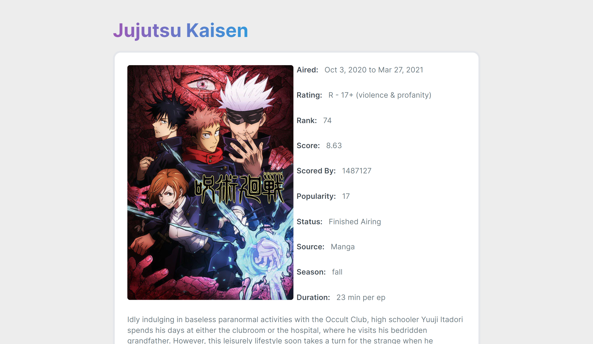
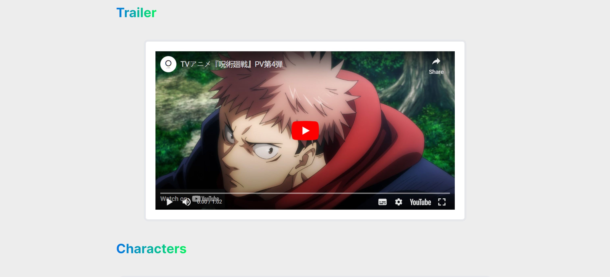
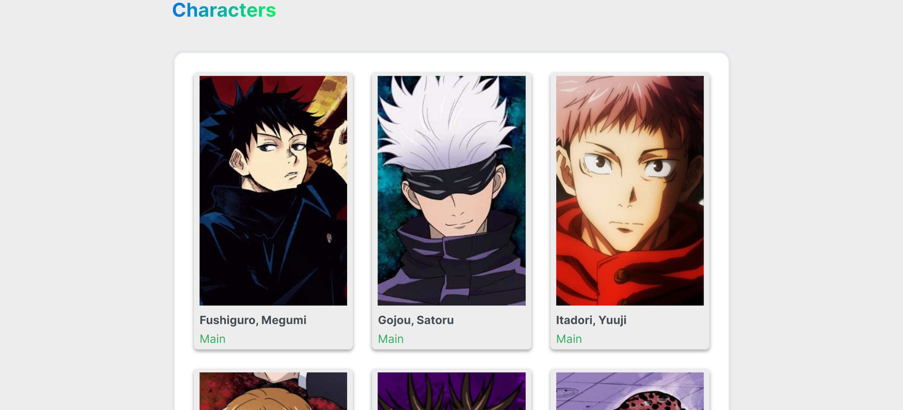
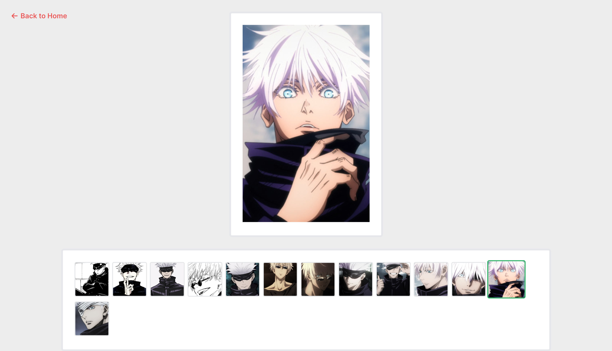

# AnimeVerse

AnimeVerse is a comprehensive online destination dedicated to anime enthusiasts. It serves as a virtual universe for anime lovers, providing a wide range of information and resources about various anime series, movies, characters, and genres. Dive into the AnimeVerse to explore the captivating world of anime, discover hidden gems, and stay updated with the latest happenings in the anime realm. Whether you're a seasoned otaku or just starting your anime journey, AnimeVerse is your go-to platform to immerse yourself in the enchanting universe of anime.


## Table of Contents

- [Introduction](#animeverse)
- [Project Overview](#project-overview)
- [Technologies Used](#technologies-used)
- [Getting Started](#getting-started)
  - [Installation](#installation)
  - [Usage](#usage)
- [Screenshots](#screenshots)
- [Contributing](#contributing)
- [License](#license)


## Project Overview

This project is aimed at enhancing understanding and proficiency in working with React's Context API and styled-components. AnimeVerse provides users with a user-friendly interface to browse and explore various anime series, movies, and characters. Users can find detailed information about each anime, including synopsis, episodes, characters, and genres.


## Technologies Used

The following technologies were used in building the AnimeVerse platform:

- React.js
- React Context API
- styled-components


## Getting Started

To run AnimeVerse locally on your machine, follow the steps below:


### Installation

1. Clone the repository to your local machine:

```
git clone https://github.com/dev-akhilesh/animeverse.git
```

2. Change into the project directory:

```
cd animeverse
```

3. Install the required dependencies using npm:

```
npm install
```


### Usage

1. Run the development server:

```
npm start
```

2. Open your web browser and navigate to `http://localhost:3000` to access AnimeVerse.


## Screenshots

### Homepage


### Anime Details



### Anime Trailer



### Characters



### Charecter Images Gallery




## Contributing

Contributions are welcome! If you find any issues or have suggestions for improvement, please feel free to create a pull request or open an issue in the repository.
